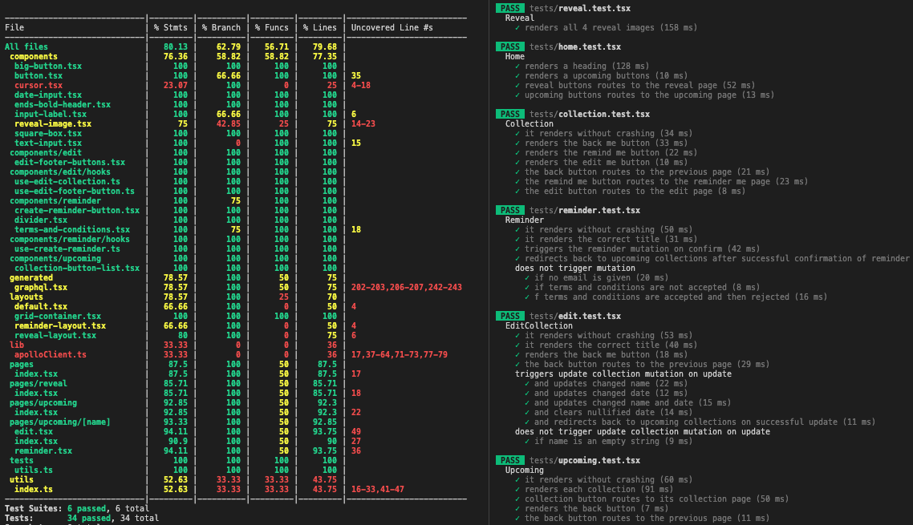

# FAIR-XYZ Take Home Challenge FE

<a href="https://coveralls.io/github/nestjs/nest?branch=master" target="_blank"></a>

## Getting Started

1. If you have not already, go to the [BE repo](https://github.com/tommyrharper/fair-xyz-be) and get that set up. I did not hardcore any values on the FE, instead I wrote migrations which populate the BE, so you will need to get that up and running before most of the FE will work.

2. Install packages and then run the development server:

```bash
npm i
npm run dev
```

Open [http://localhost:3000](http://localhost:3000) with your browser to see the result.

## Notes

I decided I wanted this to be done this weekend, and so am not going to do any more at this point.

Here are a few things I would do if I was going to spend more time on this:
- Check if the email addresses are real on the FE and BE.
- Elegantly handle duplicate requests for a reminder with the same email (currently this just throws a big error).
- Elegantly reject launch dates that are in the past on the FE and BE.
- Optimize the site with getStaticProps.
- Improve styling, particularly the edit page.
- Add CI/CD running tests and linting etc on the FE and BE.

## Testing

Again, like on the back-end, I skipped e2e testing in this case, so that is something I would like to do if I had more time.

I hit 80% test coverage which could be improved, but I am reasonably happy with it as all the most important functionality (that I have implemented) is tested.

All the routing and buttons on the pages are tested and all the mutations and input forms are tested for all their major functionality.



## Design decisions

There is not much to note on this one in terms of design decisions, as I basically just followed the instructions in the given in the task and did not use any other technologies.

Also Next.js is very opinionated (in a good way), which made it hard for me to stray too far.
